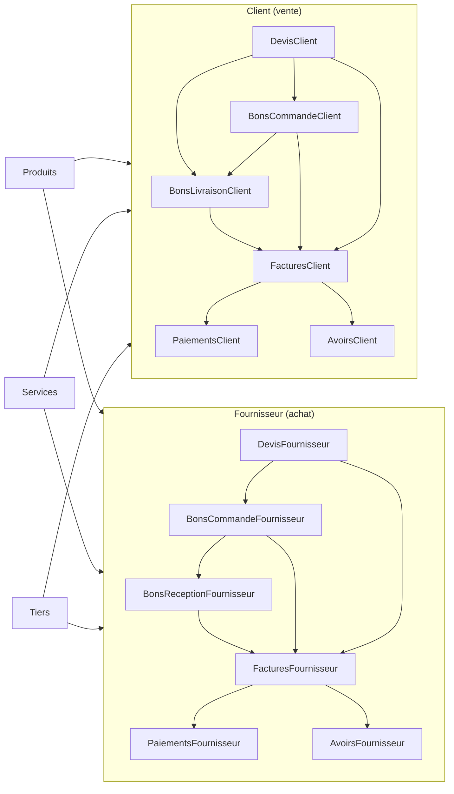
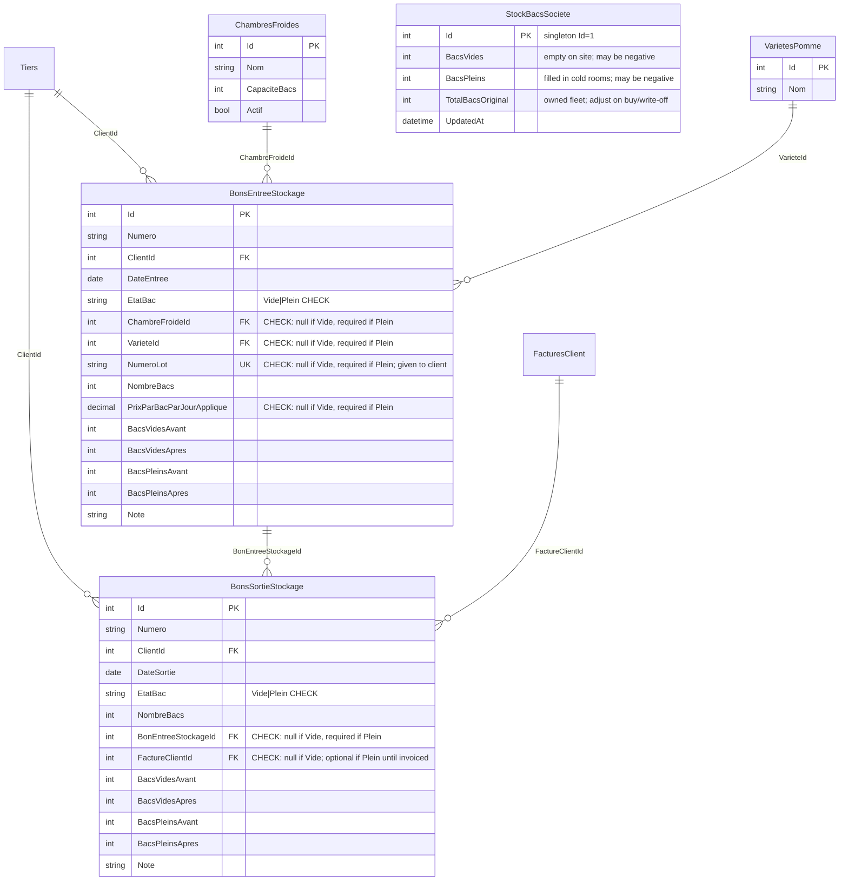

# Database schema

SQLite database used by **Gestion Commerciale** (EF Core).  
Source of truth: entity models + `AppDbContext` / `AppDbContextModelSnapshot`.

Almost every business table inherits **`BaseEntity`**:

| Column | Type | Notes |
|--------|------|--------|
| `Id` | `int` PK | Auto-increment |
| `CreatedAt` | `DateTime` | Set on insert (UTC) |
| `UpdatedAt` | `DateTime` | Set on insert/update (UTC) |
| `CreatedByUserId` | `int?` | Optional user id |

---

## Document families (5 × 2)

Same five document types on both sides; table names always include **Client** or **Fournisseur**.

| # | Document | Client (vente) | Fournisseur (achat) |
|--:|----------|----------------|---------------------|
| 1 | Devis | `DevisClient` | `DevisFournisseur` |
| 2 | Bon de commande | `BonsCommandeClient` | `BonsCommandeFournisseur` |
| 3 | Livraison / réception | `BonsLivraisonClient` | `BonsReceptionFournisseur` |
| 4 | Facture | `FacturesClient` | `FacturesFournisseur` |
| 5 | Avoir | `AvoirsClient` | `AvoirsFournisseur` |

On the purchase side, the delivery equivalent is a **bon de réception** (goods received from the supplier).

---

## Document flows



---

## Entity-relationship diagram

```mermaid
erDiagram
    Tiers {
        int Id PK
        string Type "Client|Fournisseur|LesDeux"
        string Nom
        string ICE
        string Adresse
        string Ville
        string Telephone
        string Email
        string ConditionsPaiement
        bool Actif
    }

    Categories {
        int Id PK
        string Nom
    }

    Produits {
        int Id PK
        string Reference UK
        string CodeBarre
        string Designation
        string Unite
        decimal PrixAchatHT
        decimal PrixVenteHT
        decimal TauxTVA
        decimal StockActuel
        decimal StockMinimum
        int CategorieId FK
        bool Actif
        blob ImageData
    }

    Services {
        int Id PK
        string Reference UK
        string Designation
        string Unite
        decimal PrixVenteHT
        decimal CoutHT
        decimal TauxTVA
        bool Actif
        string Note
        blob ImageData
    }

    MouvementsStock {
        int Id PK
        int ProduitId FK
        string Type "Entree|Sortie|Ajustement"
        decimal StockAvant
        decimal Quantite
        string OrigineType
        int OrigineId
        string Note
    }

    TypesCharge {
        int Id PK
        string Nom UK
        bool Actif
    }

    Charges {
        int Id PK
        int TypeChargeId FK
        date Date
        string Libelle
        int FournisseurId FK
        string BeneficiaireLibre
        decimal MontantTtc
        string Note
    }

    AppSettings {
        int Id PK
        string SocieteNom
        string SocieteAdresse
        string SocieteICE
        string SocieteMentionsLegales
        string SocieteLogoPath
        string TauxTVAJson
        bool BlocageSiStockInsuffisant
        int DevisValiditeJoursDefaut
        string Devise
        string UiLanguage
        bool BackupEnabled
        int BackupIntervalHours
        string BackupIntervalUnit
        int BackupRetentionDays
        string BackupDirectory
        datetime LastBackupDate
        decimal PrixStockageParBacParJour
    }

    %% ========== CLIENT (vente) ==========

    DevisClient {
        int Id PK
        string Numero
        int ClientId FK
        date Date
        date DateValidite
        decimal RemiseGlobale
        string Note
    }

    DevisClientLignes {
        int Id PK
        int DevisClientId FK
        int ProduitId FK
        int ServiceId FK
        string Designation
        decimal Quantite
        decimal PrixUnitaireHT
        decimal Remise
        decimal TauxTVA
        string Conditionnement
    }

    DevisClientConditions {
        int Id PK
        int DevisClientId FK
        string Titre
        string Valeur
        int Ordre
    }

    BonsCommandeClient {
        int Id PK
        string Numero
        int ClientId FK
        int DevisClientId FK
        int FactureClientId FK
        date Date
        string Note
    }

    BonCommandeClientLignes {
        int Id PK
        int BonCommandeClientId FK
        int ProduitId FK
        int ServiceId FK
        string Designation
        decimal QuantiteCommandee
        decimal PrixUnitaireHT
        decimal Remise
        decimal TauxTVA
        string Conditionnement
    }

    BonsLivraisonClient {
        int Id PK
        string Numero
        int ClientId FK
        int DevisClientId FK
        int BonCommandeClientId FK
        int FactureClientId FK
        date Date
        string Note
    }

    BonLivraisonClientLignes {
        int Id PK
        int BonLivraisonClientId FK
        int ProduitId FK
        int ServiceId FK
        string Designation
        decimal QuantiteCommandee
        decimal QuantiteLivree
        decimal PrixUnitaireHT
        decimal Remise
        decimal TauxTVA
    }

    FacturesClient {
        int Id PK
        string Numero
        int ClientId FK
        int DevisClientId FK
        date Date
        date DateEcheance
        bool EstPayee
        decimal RemiseGlobale
        decimal TotalTtc
        string Note
        string BonCommandeReference
    }

    FactureClientLignes {
        int Id PK
        int FactureClientId FK
        int BonLivraisonClientId FK
        int ProduitId FK
        int ServiceId FK
        string Designation
        decimal Quantite
        decimal PrixUnitaireHT
        decimal Remise
        decimal TauxTVA
        string Conditionnement
    }

    PaiementsClient {
        int Id PK
        int FactureClientId FK
        decimal Montant
        date Date
        string Mode "Credit|Cheque|Especes|TPE|Virement|Effet"
        string Reference
    }

    AvoirsClient {
        int Id PK
        string Numero
        int FactureClientId FK
        int ClientId FK
        date Date
        string Motif
        bool RetourMarchandise
    }

    AvoirClientLignes {
        int Id PK
        int AvoirClientId FK
        int ProduitId FK
        int ServiceId FK
        string Designation
        decimal Quantite
        decimal PrixUnitaireHT
        decimal Remise
        decimal TauxTVA
        string Conditionnement
    }

    %% ========== FOURNISSEUR (achat) ==========

    DevisFournisseur {
        int Id PK
        string Numero
        int FournisseurId FK
        date Date
        date DateValidite
        decimal RemiseGlobale
        string Note
    }

    DevisFournisseurLignes {
        int Id PK
        int DevisFournisseurId FK
        int ProduitId FK
        int ServiceId FK
        string Designation
        decimal Quantite
        decimal PrixUnitaireHT
        decimal Remise
        decimal TauxTVA
        string Conditionnement
    }

    DevisFournisseurConditions {
        int Id PK
        int DevisFournisseurId FK
        string Titre
        string Valeur
        int Ordre
    }

    BonsCommandeFournisseur {
        int Id PK
        string Numero
        int FournisseurId FK
        int DevisFournisseurId FK
        int FactureFournisseurId FK
        date Date
        string Note
    }

    BonCommandeFournisseurLignes {
        int Id PK
        int BonCommandeFournisseurId FK
        int ProduitId FK
        int ServiceId FK
        string Designation
        decimal QuantiteCommandee
        decimal PrixUnitaireHT
        decimal Remise
        decimal TauxTVA
        string Conditionnement
    }

    BonsReceptionFournisseur {
        int Id PK
        string Numero
        int BonCommandeFournisseurId FK
        int FournisseurId FK
        int DevisFournisseurId FK
        int FactureFournisseurId FK
        date Date
        decimal TotalTtc
        string Note
    }

    BonReceptionFournisseurLignes {
        int Id PK
        int BonReceptionFournisseurId FK
        int ProduitId FK
        int ServiceId FK
        string Designation
        decimal QuantiteRecue
        decimal PrixUnitaireHT
        decimal TauxTVA
    }

    FacturesFournisseur {
        int Id PK
        string Numero
        int FournisseurId FK
        int DevisFournisseurId FK
        date Date
        date DateEcheance
        bool EstPayee
        decimal RemiseGlobale
        decimal TotalTtc
        string Note
    }

    FactureFournisseurLignes {
        int Id PK
        int FactureFournisseurId FK
        int BonReceptionFournisseurId FK
        int ProduitId FK
        int ServiceId FK
        string Designation
        decimal Quantite
        decimal PrixUnitaireHT
        decimal Remise
        decimal TauxTVA
        string Conditionnement
    }

    PaiementsFournisseur {
        int Id PK
        int FactureFournisseurId FK
        decimal Montant
        date Date
        string Mode "Credit|Cheque|Especes|TPE|Virement|Effet"
        string Reference
    }

    AvoirsFournisseur {
        int Id PK
        string Numero
        int FactureFournisseurId FK
        int FournisseurId FK
        date Date
        string Motif
        bool RetourMarchandise
    }

    AvoirFournisseurLignes {
        int Id PK
        int AvoirFournisseurId FK
        int ProduitId FK
        int ServiceId FK
        string Designation
        decimal Quantite
        decimal PrixUnitaireHT
        decimal Remise
        decimal TauxTVA
        string Conditionnement
    }

    Categories ||--o{ Produits : "CategorieId"
    Produits ||--o{ MouvementsStock : "ProduitId"
    TypesCharge ||--o{ Charges : "TypeChargeId"
    Tiers ||--o{ Charges : "FournisseurId"

    %% Client relations
    Tiers ||--o{ DevisClient : "ClientId"
    DevisClient ||--o{ DevisClientLignes : "DevisClientId"
    DevisClient ||--o{ DevisClientConditions : "DevisClientId"
    Produits ||--o{ DevisClientLignes : "ProduitId"
    Services ||--o{ DevisClientLignes : "ServiceId"

    Tiers ||--o{ BonsCommandeClient : "ClientId"
    DevisClient ||--o{ BonsCommandeClient : "DevisClientId"
    FacturesClient ||--o{ BonsCommandeClient : "FactureClientId"
    BonsCommandeClient ||--o{ BonCommandeClientLignes : "BonCommandeClientId"

    Tiers ||--o{ BonsLivraisonClient : "ClientId"
    DevisClient ||--o{ BonsLivraisonClient : "DevisClientId"
    BonsCommandeClient ||--o{ BonsLivraisonClient : "BonCommandeClientId"
    FacturesClient ||--o{ BonsLivraisonClient : "FactureClientId"
    BonsLivraisonClient ||--o{ BonLivraisonClientLignes : "BonLivraisonClientId"

    Tiers ||--o{ FacturesClient : "ClientId"
    DevisClient ||--o{ FacturesClient : "DevisClientId"
    FacturesClient ||--o{ FactureClientLignes : "FactureClientId"
    FacturesClient ||--o{ PaiementsClient : "FactureClientId"
    BonsLivraisonClient ||--o{ FactureClientLignes : "BonLivraisonClientId"

    Tiers ||--o{ AvoirsClient : "ClientId"
    FacturesClient ||--o{ AvoirsClient : "FactureClientId"
    AvoirsClient ||--o{ AvoirClientLignes : "AvoirClientId"

    %% Fournisseur relations
    Tiers ||--o{ DevisFournisseur : "FournisseurId"
    DevisFournisseur ||--o{ DevisFournisseurLignes : "DevisFournisseurId"
    DevisFournisseur ||--o{ DevisFournisseurConditions : "DevisFournisseurId"
    Produits ||--o{ DevisFournisseurLignes : "ProduitId"
    Services ||--o{ DevisFournisseurLignes : "ServiceId"

    Tiers ||--o{ BonsCommandeFournisseur : "FournisseurId"
    DevisFournisseur ||--o{ BonsCommandeFournisseur : "DevisFournisseurId"
    FacturesFournisseur ||--o{ BonsCommandeFournisseur : "FactureFournisseurId"
    BonsCommandeFournisseur ||--o{ BonCommandeFournisseurLignes : "BonCommandeFournisseurId"

    Tiers ||--o{ BonsReceptionFournisseur : "FournisseurId"
    DevisFournisseur ||--o{ BonsReceptionFournisseur : "DevisFournisseurId"
    BonsCommandeFournisseur ||--o{ BonsReceptionFournisseur : "BonCommandeFournisseurId"
    FacturesFournisseur ||--o{ BonsReceptionFournisseur : "FactureFournisseurId"
    BonsReceptionFournisseur ||--o{ BonReceptionFournisseurLignes : "BonReceptionFournisseurId"

    Tiers ||--o{ FacturesFournisseur : "FournisseurId"
    DevisFournisseur ||--o{ FacturesFournisseur : "DevisFournisseurId"
    FacturesFournisseur ||--o{ FactureFournisseurLignes : "FactureFournisseurId"
    FacturesFournisseur ||--o{ PaiementsFournisseur : "FactureFournisseurId"
    BonsReceptionFournisseur ||--o{ FactureFournisseurLignes : "BonReceptionFournisseurId"

    Tiers ||--o{ AvoirsFournisseur : "FournisseurId"
    FacturesFournisseur ||--o{ AvoirsFournisseur : "FactureFournisseurId"
    AvoirsFournisseur ||--o{ AvoirFournisseurLignes : "AvoirFournisseurId"

    %% Catalog FKs on lines
    Produits ||--o{ BonCommandeClientLignes : "ProduitId"
    Services ||--o{ BonCommandeClientLignes : "ServiceId"
    Produits ||--o{ BonLivraisonClientLignes : "ProduitId"
    Services ||--o{ BonLivraisonClientLignes : "ServiceId"
    Produits ||--o{ FactureClientLignes : "ProduitId"
    Services ||--o{ FactureClientLignes : "ServiceId"
    Produits ||--o{ AvoirClientLignes : "ProduitId"
    Services ||--o{ AvoirClientLignes : "ServiceId"
    Produits ||--o{ BonCommandeFournisseurLignes : "ProduitId"
    Services ||--o{ BonCommandeFournisseurLignes : "ServiceId"
    Produits ||--o{ BonReceptionFournisseurLignes : "ProduitId"
    Services ||--o{ BonReceptionFournisseurLignes : "ServiceId"
    Produits ||--o{ FactureFournisseurLignes : "ProduitId"
    Services ||--o{ FactureFournisseurLignes : "ServiceId"
    Produits ||--o{ AvoirFournisseurLignes : "ProduitId"
    Services ||--o{ AvoirFournisseurLignes : "ServiceId"
```



---

## Rename map (old → new)

| Old | New |
|-----|-----|
| `Devis` / `DevisLignes` / `DevisConditions` | `DevisClient` / `DevisClientLignes` / `DevisClientConditions` |
| `BonsLivraison` / `BonLivraisonLignes` | `BonsLivraisonClient` / `BonLivraisonClientLignes` |
| `Factures` / `FactureLignes` / `Paiements` | `FacturesClient` / `FactureClientLignes` / `PaiementsClient` |
| `Avoirs` / `AvoirLignes` | `AvoirsClient` / `AvoirClientLignes` |
| `BonsReception` / `BonReceptionLignes` | `BonsReceptionFournisseur` / `BonReceptionFournisseurLignes` |
| `FacturesFournisseurs` / `PaiementsFournisseurs` / `AvoirsFournisseurs` | `FacturesFournisseur` / `PaiementsFournisseur` / `AvoirsFournisseur` |
| *(none)* | `DevisFournisseur` / `DevisFournisseurLignes` / `DevisFournisseurConditions` **(new)** |

`BonsCommandeClient` / `BonsCommandeFournisseur` were already side-qualified; FKs and line tables are aligned to the same naming.

---

## Tables (35)

| Table | Role |
|-------|------|
| `Tiers` | Clients / fournisseurs |
| `Categories` | Product categories |
| `Produits` | Product catalog + stock |
| `Services` | Service catalog |
| `MouvementsStock` | Stock movements |
| `TypesCharge` | Expense types |
| `Charges` | Expenses |
| `AppSettings` | Singleton company / app settings (`Id = 1`) |
| `DevisClient` / `DevisClientLignes` / `DevisClientConditions` | Client quotes |
| `BonsCommandeClient` / `BonCommandeClientLignes` | Client orders |
| `BonsLivraisonClient` / `BonLivraisonClientLignes` | Client delivery notes |
| `FacturesClient` / `FactureClientLignes` / `PaiementsClient` | Client invoices |
| `AvoirsClient` / `AvoirClientLignes` | Client credit notes |
| `DevisFournisseur` / `DevisFournisseurLignes` / `DevisFournisseurConditions` | Supplier quotes |
| `BonsCommandeFournisseur` / `BonCommandeFournisseurLignes` | Supplier orders |
| `BonsReceptionFournisseur` / `BonReceptionFournisseurLignes` | Goods receipts from supplier |
| `FacturesFournisseur` / `FactureFournisseurLignes` / `PaiementsFournisseur` | Supplier invoices |
| `AvoirsFournisseur` / `AvoirFournisseurLignes` | Supplier credit notes |

---

## Enums (stored as `TEXT`)

Enum columns are persisted as **text** (the enum member name), not as integers.
In EF Core this is configured with `.HasConversion<string>()`, and each column
carries a `CHECK` constraint so the database itself rejects invalid values.
Values are matched by name, so reordering enum members in C# never changes the
meaning of existing rows.

### `TypeTiers`
Column: `Tiers.Type`

```sql
Type TEXT NOT NULL CHECK (Type IN ('Client','Fournisseur','LesDeux'))
```

| Stored value | Meaning |
|--------------|---------|
| `Client` | Customer |
| `Fournisseur` | Supplier |
| `LesDeux` | Both |

### `TypeMouvement`
Column: `MouvementsStock.Type`

```sql
Type TEXT NOT NULL CHECK (Type IN ('Entree','Sortie','Ajustement'))
```

| Stored value | Meaning |
|--------------|---------|
| `Entree` | Stock in |
| `Sortie` | Stock out |
| `Ajustement` | Adjustment |

### `ModePaiement`
Columns: `PaiementsClient.Mode`, `PaiementsFournisseur.Mode`

```sql
Mode TEXT NOT NULL CHECK (Mode IN ('Credit','Cheque','Especes','TPE','Virement','Effet'))
```

| Stored value | Meaning |
|--------------|---------|
| `Credit` | On credit |
| `Cheque` | Cheque |
| `Especes` | Cash |
| `TPE` | Card terminal |
| `Virement` | Bank transfer |
| `Effet` | Bill of exchange |

### `EtatBac`
Columns: `BonsEntreeStockage.EtatBac`, `BonsSortieStockage.EtatBac`

```sql
EtatBac TEXT NOT NULL CHECK (EtatBac IN ('Vide','Plein'))
```

| Stored value | Meaning |
|--------------|---------|
| `Vide` | Empty bay (loan / return) — not charged |
| `Plein` | Filled bay in cold storage — charged at sortie |

Conditional nullability of related columns (`ChambreFroideId`, `VarieteId`, etc.)
is also enforced by table-level `CHECK` constraints — see the cold-storage section.

---

## Notes

- Engine: **SQLite** for the MVP; **PostgreSQL** later (see *Portability* below).
- Document lines use nullable **`ProduitId`** and/or **`ServiceId`**. Line **reference** text is resolved from the catalog at load time, not stored on line tables.
- Unique indexes: `Produits.Reference`, `Services.Reference`, `TypesCharge.Nom`, `BonsEntreeStockage.NumeroLot`, and every document **`Numero`** (unique per table so `devis-2026-00001` etc. can't be duplicated).
- Cascade delete: document → its lines (and payments / devis conditions).
- Document → document FKs (e.g. `BonsCommandeClient.FactureClientId`, `BonsLivraisonClient.DevisClientId`) use **Restrict** / **SetNull**, never cascade — deleting an invoice must not delete the order/delivery that references it.
- `ServiceId` FKs use **Restrict** delete.
- `AppSettings` is a singleton row (`Id = 1`).
- Table names always include **Client** or **Fournisseur** so vente and achat documents stay distinct.
- Enum columns (`Tiers.Type`, `MouvementsStock.Type`, `*.Mode`, `*.EtatBac`) are stored as **TEXT** via EF Core `.HasConversion<string>()`, each guarded by a `CHECK` constraint. Values are matched by name, so reordering the C# enums never remaps existing rows.

### Portability (SQLite → PostgreSQL)

The schema is designed so the move to PostgreSQL stays a one-line provider swap plus a `pgloader` data copy. Points to keep in mind:

- **Decimals**: EF's SQLite provider stores `decimal` as **TEXT** (no precision enforced). Set explicit precision in Fluent API now (`HasPrecision(18, 2)` for money/prices/`MontantTtc`/totals; `HasPrecision(18, 3)` for quantities/stock) so Postgres `numeric` columns match and rounding stays stable.
- **Dates**: store **UTC** `DateTime` (`BaseEntity` already does). Prefer Postgres `timestamptz`; keep pure calendar fields (`Date`, `DateEcheance`, `DateEntree`, `DateSortie`) as `date`.
- **Images (`Produits.ImageData` / `Services.ImageData`)**: BLOB → Postgres `bytea`. Works, but bloats the DB and every backup/migration copy. Consider storing a **file path** (like `SocieteLogoPath`) instead; if kept as BLOB, expect a slower `pgloader` run.
- **`CHECK` constraints & `UNIQUE`-with-NULL** (used for `NumeroLot`, `EtatBac` field rules): identical behaviour in both engines, so they carry over unchanged.
- **Migration**: build the empty Postgres schema with EF migrations (`dotnet ef database update`), then `pgloader ... WITH data only, reset sequences`. Verify row counts + spot-check decimals/dates/TEXT enums before flipping the connection string.


 this section is for renting bays for cooling 

BEGIN

## Cold storage (location de bacs / chambre froide)

Clients move **bays** (bacs) in two states:

| `EtatBac` | Meaning | Charged? |
|-----------|---------|----------|
| `Vide` | Empty bay loaned to / returned by the client | No |
| `Plein` | Filled bay deposited for cooling | Yes — at **sortie**, per bay × days |

**Flat model (one variety per bon):** each entrée/sortie is a single movement
(one client, one état, one quantity, and at most one variety). No line tables.
Several varieties on the same visit = several bons.

There is a **single global daily rate** in `AppSettings.PrixStockageParBacParJour`.
It is snapshotted onto filled entrées (`PrixParBacParJourApplique`) at deposit time.

### Typical lifecycle

```
1. Sortie  EtatBac=Vide  → client takes empty bays (debt +)
2. Entrée  EtatBac=Plein → client deposits filled bays (debt −, cooling starts)
3. Sortie  EtatBac=Plein → client picks filled bays (debt +, invoice)
4. Entrée  EtatBac=Vide  → client returns empty bays (debt −)
```

### Entity-relationship diagram



### Tables

| Table | Role |
|-------|------|
| `ChambresFroides` | Cold rooms (capacity in bays) |
| `VarietesPomme` | Apple varieties (lookup) |
| `StockBacsSociete` | Fast company bay stock (singleton); empty / full / original total |
| `BonsEntreeStockage` | Bays in — empty return **or** filled deposit (one variety per bon); stores balance snapshots |
| `BonsSortieStockage` | Bays out — empty loan **or** filled pickup; stores balance snapshots |

Daily rate: `AppSettings.PrixStockageParBacParJour` (no separate tariff table).

### Company stock (`StockBacsSociete`)

Singleton row (`Id = 1`) for **O(1) lookup** of co-op bay positions. Not a history table —
history stays on the bons. Update this row in the **same transaction** as each entrée/sortie.

| Column | Meaning |
|--------|---------|
| `BacsVides` | Empty bays available on site (ready to loan) |
| `BacsPleins` | Filled bays currently in cold rooms |
| `TotalBacsOriginal` | Owned fleet size (increase when buying bays; decrease on confirmed write-off) |
| `UpdatedAt` | Last stock update |

`Total` is **not** stored. Live accounted on-site total for checks:

```
TotalCompte = BacsVides + BacsPleins
Ecart       = TotalBacsOriginal − TotalCompte
```

Note: empty bays currently with clients are **not** in this table; they are tracked per client
on the bons / client snapshots. So `Ecart > 0` can mean lost bays **or** bays still loaned out —
use client empty balances if you need to separate those cases.

| Ecart | Meaning |
|------:|---------|
| 0 | On-site empty + filled matches original (no bays out with clients, or original was set that way) |
| &gt; 0 | Short vs original (with clients and/or lost) |
| &lt; 0 | Over-count (data error or unrecorded purchase) |

`BacsVides` / `BacsPleins` may go **negative** as an operational alarm (e.g. loaned more empty than on site).

**Updates on movements** (do not touch `TotalBacsOriginal` for normal ops):

| Movement | `BacsVides` | `BacsPleins` |
|----------|-------------|--------------|
| Sortie `Vide` | − n | — |
| Entrée `Vide` | + n | — |
| Entrée `Plein` | — | + n |
| Sortie `Plein` | — | − n |

**When to change `TotalBacsOriginal`:**

| Event | Action |
|-------|--------|
| Buy / receive new empty bays | `TotalBacsOriginal += n`, `BacsVides += n` |
| Confirmed permanent loss | `TotalBacsOriginal -= n` (and adjust the matching live field) |

App rule: before Sortie `Vide`, prefer rejecting if `n > BacsVides` (unless you intentionally allow negative stock).

### Balance snapshots (like `MouvementsStock.StockAvant`)

On every entrée/sortie, store the client's bay balances **before and after** the movement
(same idea as product `StockAvant` / quantity):

| Column | Meaning |
|--------|---------|
| `BacsVidesAvant` / `Apres` | Company bays currently **with the client** (loan debt) — empty at their site **or** filled taken home after pickup |
| `BacsPleinsAvant` / `Apres` | Filled bays of this client currently **in cold storage** |

Filled bays are the return of loaned empties, so **Entrée Plein reduces client debt**.
**Sortie Plein** puts company bays back with the client, so debt increases again until **Entrée Vide**.

| Movement | Client debt (`BacsVides`) | Client filled in chambre (`BacsPleins`) |
|----------|---------------------------|----------------------------------------|
| Sortie `Vide` | + n | — |
| Entrée `Vide` | − n | — |
| Entrée `Plein` | **− n** | + n |
| Sortie `Plein` | **+ n** | − n |

**Flexibility (v1):** client debt **may go negative** (e.g. Entrée Plein with debt 0, or more filled than borrowed — own bays / unrecorded loan). Do **not** reject; tighten later if needed. Partial deposit is fine (took 20 empty, brings 10 filled → debt 10).

Live remaining can still be recomputed from movements; snapshots are for **audit /
“what was the stock at that transaction”**. Prefer not editing past bons, or rebuild
snapshots (and `StockBacsSociete`) if you allow corrections.

### Field rules by `EtatBac` (database `CHECK` constraints)

These are **not** app-only rules — they must be enforced in SQLite via table `CHECK`s
(EF Core: `.ToTable(t => t.HasCheckConstraint(...))`).

**`BonsEntreeStockage`**

```sql
CHECK (EtatBac IN ('Vide','Plein'))

CHECK (
  (EtatBac = 'Vide'  AND ChambreFroideId IS NULL AND VarieteId IS NULL
                     AND NumeroLot IS NULL AND PrixParBacParJourApplique IS NULL)
  OR
  (EtatBac = 'Plein' AND ChambreFroideId IS NOT NULL AND VarieteId IS NOT NULL
                     AND NumeroLot IS NOT NULL AND PrixParBacParJourApplique IS NOT NULL)
)

-- Unique among filled deposits (SQLite allows multiple NULLs for Vide rows)
UNIQUE (NumeroLot)
```

**`BonsSortieStockage`**

```sql
CHECK (EtatBac IN ('Vide','Plein'))

CHECK (
  (EtatBac = 'Vide'  AND BonEntreeStockageId IS NULL AND FactureClientId IS NULL)
  OR
  (EtatBac = 'Plein' AND BonEntreeStockageId IS NOT NULL)
)
```

`FactureClientId` stays nullable when `EtatBac = 'Plein'` until the sortie is invoiced;
when `Vide`, it must stay null (no cooling invoice).

`NumeroLot` is generated at filled deposit and given to the client for tracking
(e.g. `LOT-2026-00042`). At pickup, the client presents it; the app resolves
`BonsEntreeStockage` via `NumeroLot` and sets `BonEntreeStockageId` on the sortie.

| Field | `Vide` | `Plein` |
|-------|--------|---------|
| `NombreBacs` | required | required |
| `ChambreFroideId` (entrée) | must be null | must be set |
| `VarieteId` (entrée) | must be null | must be set |
| `NumeroLot` (entrée) | must be null | must be set (unique; given to client) |
| `PrixParBacParJourApplique` (entrée) | must be null | must be set |
| `BonEntreeStockageId` (sortie) | must be null | must be set |
| `FactureClientId` (sortie) | must be null | optional until invoiced |

### Balances (per client)

Company bays currently with the client (loan debt; may be negative):

```
bacsChezClient =
    Σ(sorties Vide.NombreBacs)
  − Σ(entrées Vide.NombreBacs)
  − Σ(entrées Plein.NombreBacs)
  + Σ(sorties Plein.NombreBacs)
```

Filled bays of this client still in cold storage:

```
bacsPleinsEnChambre =
    Σ(entrées Plein.NombreBacs)
  − Σ(sorties Plein.NombreBacs)
```

Filled bays still in a given deposit:

```
bacsEnStock(entrée) = entréePlein.NombreBacs − Σ(sorties Plein with BonEntreeStockageId = entrée.Id)
```
### Billing logic (filled only)

Charge only on **sortie** with `EtatBac = 'Plein'`:

```
duree_jours = DateSortie − DateEntree   (from linked BonsEntreeStockage)
montant     = NombreBacs × duree_jours × PrixParBacParJourApplique
```

Empty movements never enter this formula.

Notes:
- One variety / one quantity per bon. Multiple varieties = multiple bons.
- On filled deposit, generate and print/give `NumeroLot` to the client for later pickup tracking.
- Entrée Plein reduces client loan debt; Sortie Plein increases it again. Debt may be negative in v1 (flexibility).
- `BacsVidesAvant/Apres` = bays with the client; `BacsPleinsAvant/Apres` = filled in chambre (like `MouvementsStock.StockAvant`).
- Company stock is read from `StockBacsSociete` (fast); bons remain the movement history.
- Duration is per-day and dynamic (unknown at deposit time).
- `PrixParBacParJourApplique` is snapshotted at filled entry so past invoices stay stable if the global rate changes.
- Day-counting rule (inclusive `fin − debut + 1`, exclusive `fin − debut`, or a minimum charge) to be decided and applied consistently.

END 

section is for renting bays for cooling 